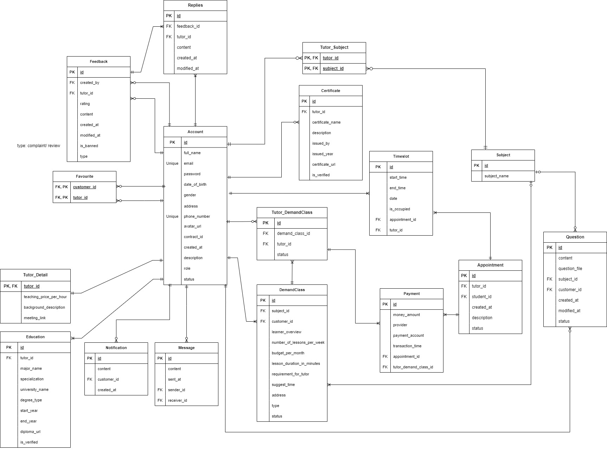

# MyTutor - Student Booking Tutor On Demand

<div align="center">
    <a href="https://mytutor.id.vn"></a>
    <p><a href="https://mytutor.id.vn">MyTutor</a> is a web application that provides services for students and tutors.</p>
</div>
<div align='center'>
 
 
 
 
 

<br>
</div>

## Table of Contents
<ol start="0"> 
    <li><a href="#intro">Introduction</a></li>
    <li><a href="#tech">Tech Stacks</a></li>
    <li><a href="#install">Installation</a></li>
    <li><a href="#api-docs">API Documentation</a></li>
    <li><a href="#uc-diagram">Use Case Diagram</a></li>
    <li><a href="#db-design">Database Design</a></li>
    <li><a href="#screen-flow"> Screen Flow</a></li>
    <li><a href="#team-members">Team Members</a></li>
    <li>
        <a href="#app-a">Appendix A</a>
        <ul><li><a href="#test-accounts">Test Accounts</a></li></ul>
    </li>
</ol>


<a id="intro"></a>
## 0. Introduction

Welcome to MyTutor, your premier online tutoring scheduling application. At MyTutor, we connect students with expert tutors from around the world, offering personalized and flexible learning experiences. Whether you're seeking help with school subjects, preparing for exams, or looking to learn a new skill, our platform makes it easy to find and schedule sessions with qualified tutors. Our user-friendly interface, secure payment system, and comprehensive tutor profiles ensure that you receive the best possible tutoring experience. Join MyTutor today and take the first step towards achieving your educational goals!

- Students can create online appointments with tutors, real-time chat 1v1, feedbacks, make payments using VNPay, MoMo, PayPal.
- Tutors can easily create profiles, showcasing their qualifications and availability.
- Admin can manage users account, view dashboards, reports.
- Moderators review and verify tutors' information, students' questions.

<a id="tech"></a>
## 1. Tech Stacks

<details>
  <summary>Client</summary>
  <ul>
    <li>Typescript</li>
    <li>Reactjs</li>
    <li>ANT Design</li>
    <li>Styled Components</li>
    <li>Axios</li>
  </ul>
</details>

<details>
  <summary>Server</summary>
  <ul>
    <li>Spring Boot</li>
    <li>Spring Mail</li>
    <li>Spring JPA</li>
    <li>Hibernate</li>
    <li>Spring Security</li>
    <li>JWT</li>
    <li>OAuth2.0</li>
    <li>Swagger OpenAPI</li>
    <li>WebSocket</li>
  </ul>
</details>

<details>
<summary>Database</summary>
  <ul>
    <li>MySQL</li>
  </ul>
</details>

<details>
<summary>Deployment</summary>
  <ul>
    <li>Docker</li>
    <li><a href="https://render.com/">Render</a></li>
    <li><a href="https://railway.app/">Railway</a></li>
  </ul>
</details>

<details>
<summary>Others</summary>
  <ul>
    <li>VNPay</li>
    <li>MoMo</li>
    <li>PayPal</li>
    <li>Firebase</li>
  </ul>
</details>

<a id="install"></a>
## 2. Installation
To get a local copy of the project up and running, follow these steps.

### Prerequisites
- Java 17 
- Maven
- MySQL

Clone the repository:

```bash
git clone https://github.com/vandatnguyen919/OnDemandTutor-Backend.git

cd OnDemandTutor-Backend
```

Configure the database
```
Add application.yml to resources
```

Build the project
```
mvn clean install
```

Run the application
```
mvn spring-boot:run
```
The application will start on http://localhost:8080.

<a id="api-docs"></a>
## 3. API Documentation

API documentation is provided using OpenAPI. Once the application is running, you can access the API documentation at:
```
http://localhost:8080/swagger-ui/index.html
```

Or access our deployed API documentation:
```
https://my-tutor-render.onrender.com/swagger-ui/index.html
```

<a id="uc-diagram"></a>
## 4. Use Case Diagram


<a id="db-design"></a>
## 5. Database Design


<a id="screen-flow"></a>
## 6. Screen Flow


<a id="team-members"></a>
## 7. Team members

- [Ho Tran Tien](https://github.com/trtien05): Front-end Leader
- [Nguyen Thi Huong Giang](https://github.com/Mia-534): Front-end Developer, UI/UX Designer
- [Nguyen Bao Anh](https://github.com/alicee-19): Front-end Developer, UI/UX Designer
- [Nguyen Van Dat](https://github.com/vandatnguyen919): Back-end Leader
- [Vo Thi Mai Hoa](https://github.com/vohoa2004): Back-end Developer

<a id="app-a"></a>
# Appendix A
<a id="test-accounts"></a>
### Test Accounts
Use the following test account to explore the <a href="https://mytutor.id.vn">MyTutor</a> application:

Student 
```
email: datnvse184172@fpt.edu.vn
password: Password123.
```
Tutor 
```
email: datnguyen.dev.demo@gmail.com
password: Password123.
```

Moderator 
```
email: vandatnguyen919@gmail.com   
password: Password123.
```

Admin 
```
email: datnguyen24.dev@gmail.com
password: Password123.
```